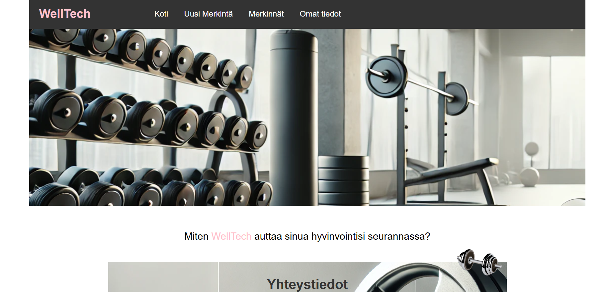

# Github IO sivu

## Tests kansion Tests.md

### Kansiosta löytyy Projekti sovellukselle tehtyjen Robot framework testien tiedostot.
- [Tests.md](/tests/front/tests.md)

## Outputs kansion Outputs.md

### Kansiosta löytyy projekti sovelluksen testien outputs tiedostot.
- [Outputs.md](/outputs/README.md)

# Tehtävien dokumentointi

## Testaus yksilötehtävät

### 1.
Käytin seuraavia komentoja jotka löytyvät linkistä https://github.com/sakluk/projekti-terveyssovelluksen-kehitys/blob/main/ohjeet_testaus/01_asennukset.md terminaalissa saadakseni asennettua Robot Framework automaatiotestaustyökalun ja sen lisäosat.

Alla olevassa kuvassa on asennusten testauksen tulos terminaalissa joka näyttää että asennukset ovat onnisuneet.

### 2. 
Tein testin oman projektin kirjautumiselle onnistuneesti.Se täyttää käyttäjätunnuksen sekä salasanan ja sen jälkeen painaa kirjaudu nappia jonka jälkeen pääsee projektin etusivulle.  Alla olevassa kuvassa näkyy kuva onnistuneesta testistä. 

### 4.
Tein testin oman projektini päiväkirja merkinnän lisäämiselle. Käytin tehtävä 2 kirjautumis testiä jolloin se eka kirjautu sisään ja sen jälkeen painoi Uusi Merkintä sivua ja sitten täytti kaikki lomakkeen tiedot ja lopuksi painoi submit nappia. Alla olevassa kuvassa näkyy onnistunut testi

### 5.
Tein testin oman projektin kirjautumiselle onnistuneesti käyttämällä env tiedostosta löytyvät Username ja passwordin.Se täyttää käyttäjätunnuksen sekä salasanan ja sen jälkeen painaa kirjaudu nappia jonka jälkeen pääsee projektin etusivulle.  Alla olevassa kuvassa näkyy kuva onnistuneesta testistä. 

### 6.
Tein testin oman projektin kirjautumiselle onnistuneesti käyttämällä cryptolibrarylla cryptattua Username ja passwordia.Se täyttää käyttäjätunnuksen sekä salasanan ja sen jälkeen painaa kirjaudu nappia jonka jälkeen pääsee projektin etusivulle.  Alla olevassa kuvassa näkyy kuva onnistuneesta testistä. 

### 7. 
Ohjasin testien loki- ja raporttitiedostot erilliseen outputs/-kansioon. komennolla robot --outputdir outputs tests/ tämä suoritti jokaisen testin ja lisäsi siihen liittyvät loki ja raporttitiedostot outputskansioon.
Alla olevassa kuvassa näkyy tiedostot outputs kansiossa.

### 8.
Julkaisin projektini Github pages sivustona. Se löytyy osoitteesta (https://jimias.github.io/frontend/)
Alla olevassa kuvassa näkyy Github.io sivustoni.

### 10.
Olen dokumenoinut tehtävien teon Github kansiooni tähän readme.md tiedostoon. 
Jokaisesta tehdystä tehtävästä löytyy pieni kuvaus ja kuva.

# Projektin kuvaus

## Kuvakaappaukset käyttöliittymästä
1. 
2. 
3. 
4. 
5. 
6. 

---------------------------------

## Linkit
- **Front-end:** [http://localhost:5173/]  
- **Back-end:** [http://127.0.0.1:3000/]  

---------------------------------

## Tietokannan kuvaus
1. **Users**: Tallentaa käyttäjien tiedot, kuten käyttäjänimen, sähköpostin, salasanan ja käyttäjätason.
2. **DiaryEntries**: Kirjaa päiväkirja merkinnät, johon kuuluu mieliala, paino, unen määrä ja muistiinpanot.

---------------------------------

## Toteutetut toiminnallisuudet

### 1. Käyttäjän rekisteröinti
  - Käyttäjä voi luoda uuden tilin antamalla käyttäjänimen, sähköpostin ja salasanan.

### 2. Käyttäjän kirjautuminen
  - Käyttäjä voi kirjautua sisään antamalla käyttäjätunnuksen ja salasanan.

### 3. Omat tiedot -sivu  
  - Näyttää kirjautuneen käyttäjän tiedot (käyttäjänimi ja sähköposti).

### 4. Uuden merkinnän luominen
  - Käyttäjä voi luoda uuden päiväkirjamerkinnän.

### 5. Merkintöjen katselu
  - Näyttää kaikki kirjautuneen käyttäjän luomat merkinnät.

---------------------------------

## Referenssit
- Tuntiesimerkit
- w3schools.com  